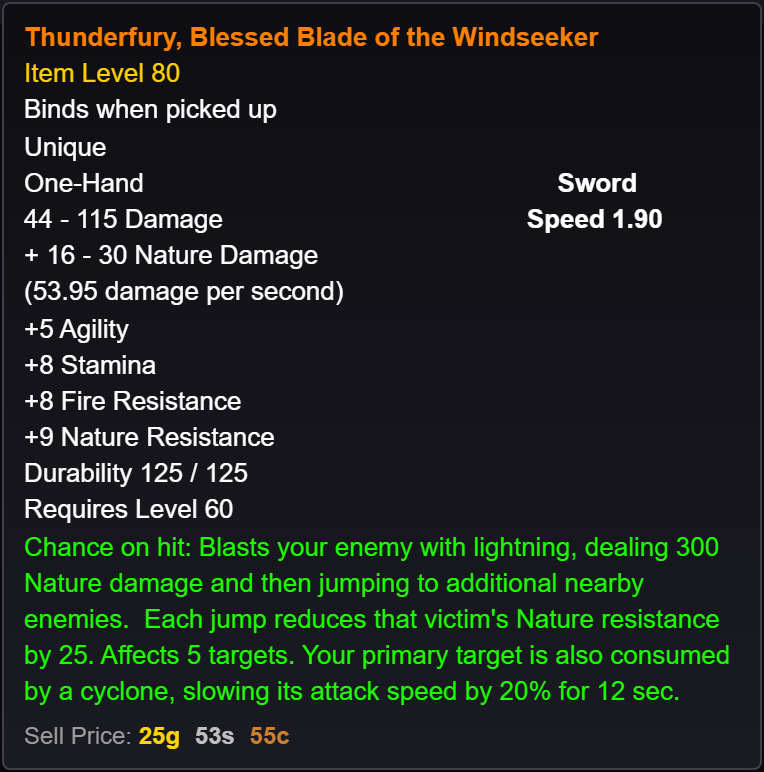
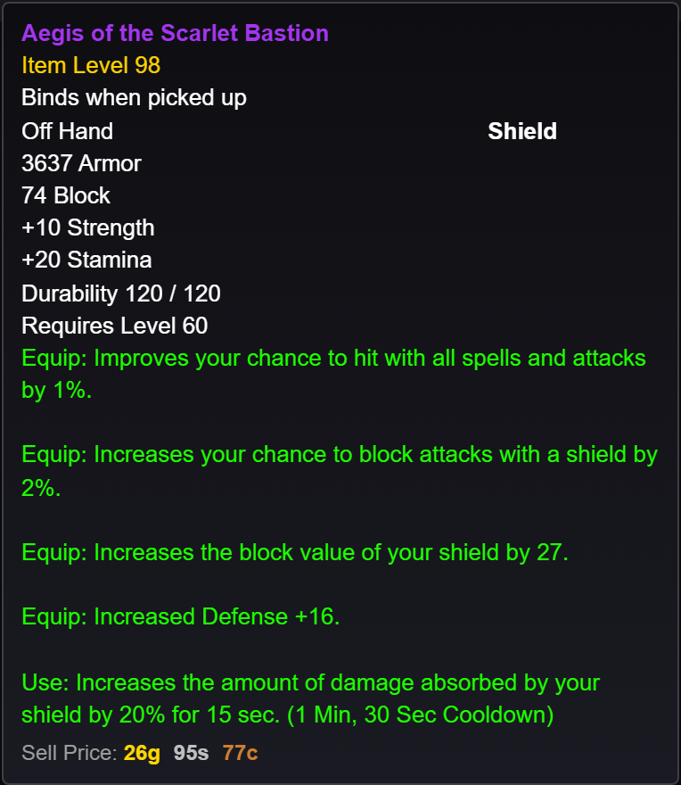
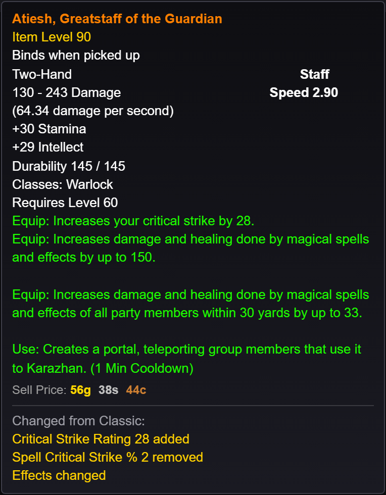
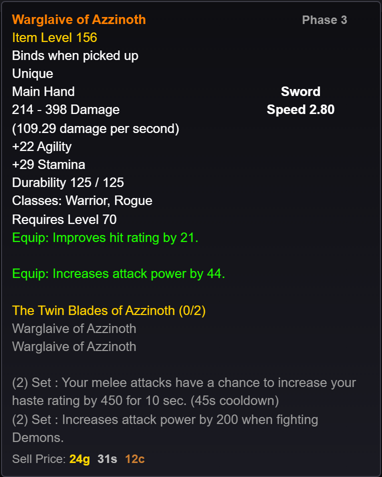
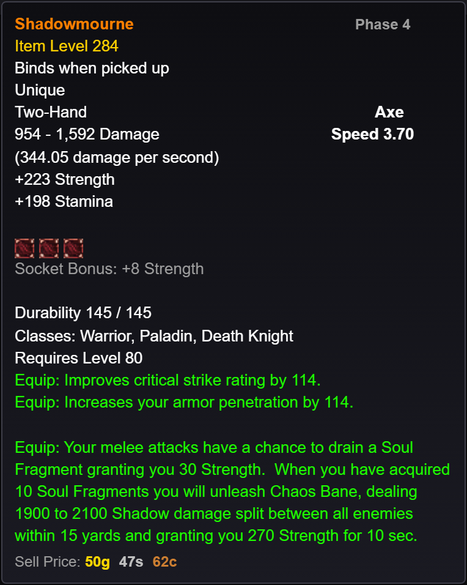
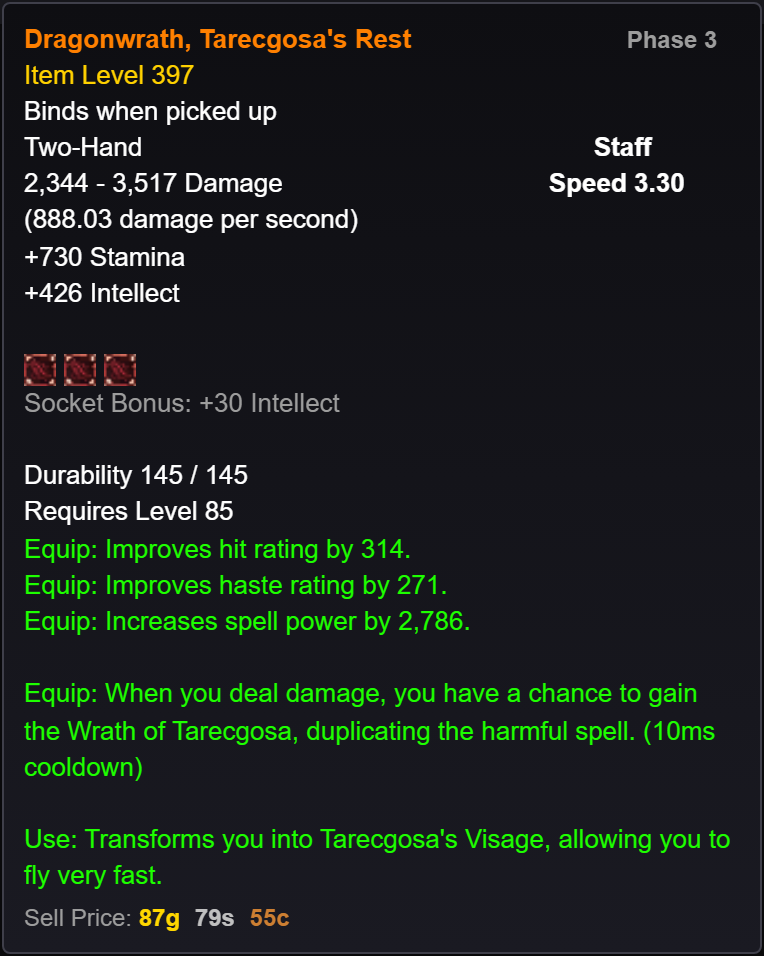
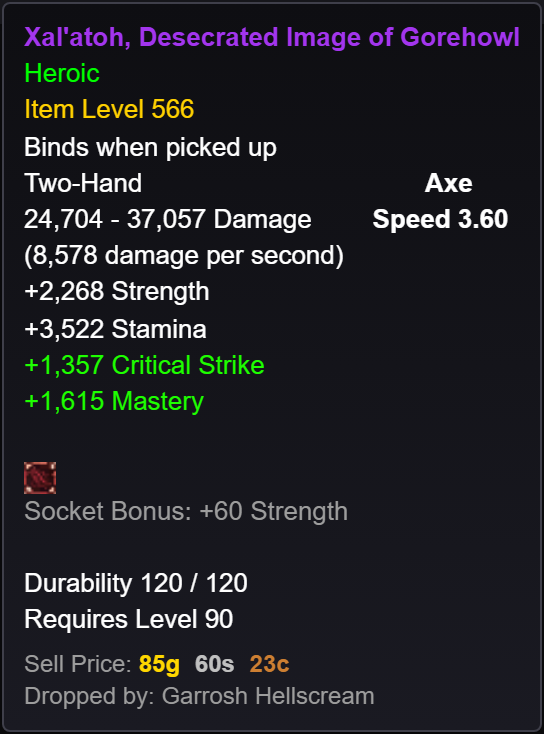
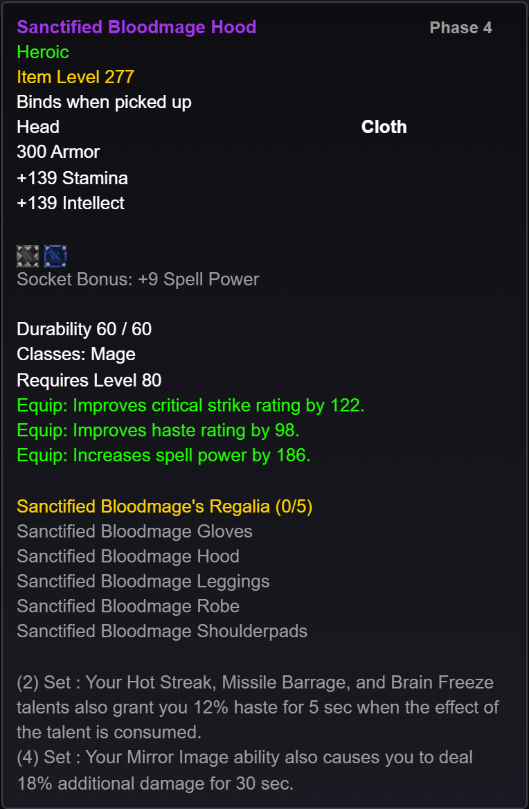
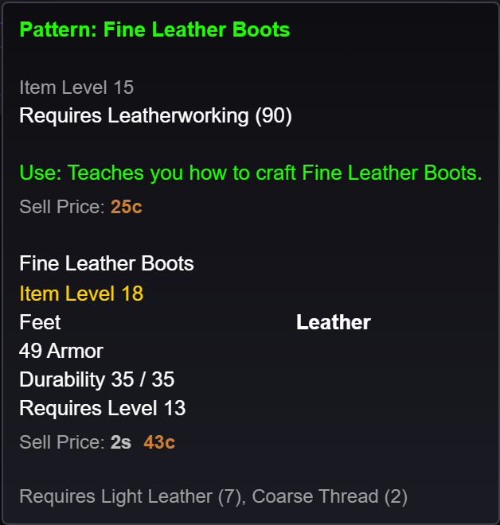
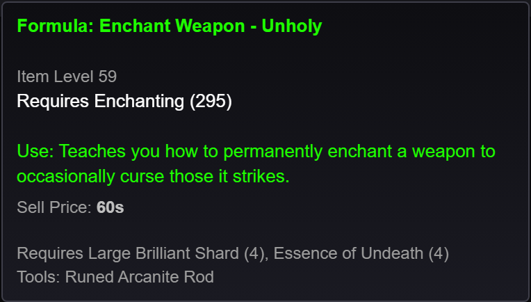

# WoW Classic Item Data Files

Offline item data for every **World of Warcraft Classic** game version: Classic Era, Season of
Discovery, Forever, TBC Classic, Wrath Classic, Cataclysm Classic and Mists of Pandaria Classic.
Each item comes with its Wowhead tooltip, its icon (included as an image) and the sources it
comes from.

It covers **72,819 items** with every way to get them: dungeon and raid bosses, world bosses,
crafting, vendors (including tier-token and currency vendors), reputation, quests, PvP, tabards,
rare elites, and world and holiday drops. That includes every leveling weapon and armor piece at
every level, and every recipe with the materials it needs.

Use it to build BiS lists, wishlists, loot trackers, gear planners, leveling guides, crafting and
gold-farming tools or item search, entirely offline: tooltips and icons included, with no calls
to Wowhead or Blizzard at runtime. These are the same files the
[WoW Classic Raid Tools](https://github.com/Napalmsteak/WoW-Classic-Raid-Tools-Releases) desktop
app ships with.

| File | Purpose |
|---|---|
| `itemDatabaseSources.json` | Every source the items reference (582): dungeons, raids, world bosses, professions, recipe groups, vendors, reputations and more. Plain JSON, usable from any language |
| `itemDatabaseSources.js` | The same list as a CommonJS module, for Node.js / TypeScript |
| `Classic Era Cache.json` | Classic Era items (8,490 · 14.5 MB) |
| `Season of Discovery Cache.json` | Season of Discovery items (6,623 · 16.0 MB) |
| `Forever Cache.json` | Forever items (9,667 · 17.4 MB). **Beta snapshot**, see below |
| `TBC Classic Cache.json` | TBC Classic items (7,943 · 16.4 MB) |
| `Wrath Classic Cache.json` | Wrath Classic items (12,136 · 26.4 MB) |
| `Cata Classic Cache.json` | Cataclysm Classic items (12,199 · 23.3 MB) |
| `MoP Classic Cache.json` | Mists of Pandaria Classic items (15,761 · 31.8 MB) |
| `icons/` | Every item's icon, `<iconName>.jpg` (6,206 · 36 × 36 px · 6.7 MB) |
| `sockets/` | Socket images for tooltips, `socket-<color>.gif` (red, yellow, blue, meta, prismatic, cogwheel, hydraulic) |

Most items are weapons and armor, and every item level is covered: every uncommon (green), rare
(blue) and epic (purple) weapon and armor piece, including world drops and quest rewards, plus
every recipe (patterns, plans, formulas, designs, schematics and more). Recipe items that exist in
the game's data but can't be obtained are left out. Forever is the exception: its beta snapshot
has the gear Wowhead lists for it so far, without leveling gear or recipe lists.

---

## Tooltips

Each item's `tooltipHtml` is the full in-game tooltip. Here is one item from each game version's
file, rendered with a small stylesheet (see [Rendering tooltips](#rendering-tooltips)), as the
[WoW Classic Raid Tools](https://github.com/Napalmsteak/WoW-Classic-Raid-Tools-Releases) shows them:

<table>
<tr>
<td align="center" valign="top"><br><b>Classic Era</b>: Thunderfury</td>
<td align="center" valign="top"><br><b>Season of Discovery</b>: Aegis of the Scarlet Bastion</td>
</tr>
<tr>
<td align="center" valign="top"><br><b>Forever</b>: Atiesh, with its <code>changeFromClassic</code> lines</td>
<td align="center" valign="top"><br><b>TBC Classic</b>: Warglaive of Azzinoth</td>
</tr>
<tr>
<td align="center" valign="top"><br><b>Wrath Classic</b>: Shadowmourne</td>
<td align="center" valign="top"><br><b>Cata Classic</b>: Dragonwrath, Tarecgosa's Rest</td>
</tr>
<tr>
<td align="center" valign="top"><br><b>MoP Classic</b>: Xal'atoh, Desecrated Image of Gorehowl</td>
<td align="center" valign="top"><br><b>A tier set piece</b> (Wrath, Mage T10): sockets, class, set pieces and bonuses</td>
</tr>
<tr>
<td align="center" valign="top"><br><b>A recipe</b> (Classic Era): the item it makes and its materials</td>
<td align="center" valign="top"><br><b>An enchanting formula</b> (Classic Era): its materials and rod</td>
</tr>
</table>

---

## Game versions

| Expansion name in the data | Game | Wowhead base URL |
|---|---|---|
| `Classic Era` | Classic Era (also Anniversary and Hardcore realms) | `https://www.wowhead.com/classic/` |
| `Season of Discovery` | Season of Discovery | `https://www.wowhead.com/classic/` |
| `Forever` | World of Warcraft: Forever (beta) | `https://www.wowhead.com/forever/` |
| `TBC Classic` | The Burning Crusade Classic | `https://www.wowhead.com/tbc/` |
| `Wrath Classic` | Wrath of the Lich King Classic | `https://www.wowhead.com/wotlk/` |
| `Cata Classic` | Cataclysm Classic | `https://www.wowhead.com/cata/` |
| `MoP Classic` | Mists of Pandaria Classic | `https://www.wowhead.com/mop-classic/` |

**Season of Discovery** shares Classic Era's item ids, and Wowhead lists both under `/classic/`.
An item from the base game appears in both files, while SoD's own items only appear in its file.

**Forever** is a "Classic+" game. It reworks many Classic items under their *original* item ids,
so the same id can have different stats in Forever than in Classic Era. Never look up a Forever
item by id in another file, and vice versa. Forever is still in **beta**: its data is a snapshot
that changes as the beta does. Its raids are listed as sources but have no items in this
snapshot yet.

---

## `itemDatabaseSources.json` / `itemDatabaseSources.js`

The same data in two encodings: one object per source an item can come from. Use the `.json`
anywhere, or `require()` the `.js` in Node.js (`ITEM_DATABASE_SOURCES`).

### Source object

```jsonc
{
  "key":       "classic era::raid::naxxramas",  // Stable lowercase composite id: "<expansion>::<type>::<name>"
  "expansion": "Classic Era",                   // Game version (see the table above)
  "name":      "Naxxramas",                     // Display name: an instance, profession, faction, vendor group…
  "type":      "Raid",                          // Source type, see below
  "phase":     6                                // Content phase the source arrived in (1 for always-available sources)
}
```

`key` matches the entries of each item's `sourceKeys`. It's the join field between the two datasets.

### Source types

| `type` | What it covers | Example `name`s |
|---|---|---|
| `Dungeon` | 5-player dungeon bosses | The Deadmines, Utgarde Pinnacle |
| `Raid` | Raid bosses | Molten Core, Icecrown Citadel |
| `WorldBoss` | Outdoor world bosses, holiday and seasonal bosses | World Bosses, Holiday bosses, Scourge Invasion |
| `Crafted` | Made with a profession | Blacksmithing, Tailoring, Jewelcrafting |
| `Recipe` | Recipe items, by profession (the item also has a source for where the recipe comes from) | Leatherworking, Enchanting, Cooking, Books |
| `Vendor` | Bought from vendors, including tier tokens and currencies | Vendors, Naxxramas tier (T7), Emblem of Frost, Champion's Seal, Timeless Isle |
| `Reputation` | Faction reputation rewards | The Aldor, Argent Crusade, Golden Lotus |
| `Quest` | Quest rewards | Quest rewards |
| `PvP` | Honor, arena and battleground gear | Honor Points, Arena Points, Warsong Gulch Mark of Honor |
| `Tabard` | Tabards | Tabards |
| `Drop` | World drops: rare elites, containers, world epics, scenarios | Rare elites, World drops, Scenario rewards |
| `Other` | Sources that fit no other type; in Forever, achievements and sources not yet known | Other sources, Achievement, Unknown source |

### Sources per game version

| Expansion | Dungeon | Raid | World Boss | Crafted | Recipe | Vendor | Reputation | Quest | PvP | Tabard | Drop | Other | Total |
|---|---|---|---|---|---|---|---|---|---|---|---|---|---|
| Classic Era | 20 | 7 | 2 | 5 | 10 | 1 | 4 | 1 | 1 | 1 | 2 | 1 | 55 |
| Season of Discovery | 12 | 10 | 2 | 5 | 9 | 9 | 8 | 1 | 2 | 1 | 2 | — | 61 |
| Forever | 28 | 3 | — | 1 | — | 1 | — | 1 | — | — | 1 | 2 | 37 |
| TBC Classic | 16 | 9 | 2 | 7 | 11 | 2 | 20 | 1 | 3 | 1 | 2 | — | 74 |
| Wrath Classic | 16 | 9 | 2 | 8 | 12 | 14 | 33 | 1 | 7 | 1 | 2 | 1 | 106 |
| Cata Classic | 14 | 6 | 2 | 9 | 10 | 10 | 54 | 1 | 5 | 1 | 2 | — | 114 |
| MoP Classic | 9 | 6 | 2 | 9 | 10 | 15 | 71 | 1 | 7 | 1 | 3 | 1 | 135 |

---

## Item cache files (`*Cache.json`)

Each file is a JSON array of item objects for one game version, built from Wowhead.

### Item object

```jsonc
{
  "itemId": 23033,                                          // Wowhead / in-game item id
  "name": "Icy Scale Coif",                                 // Item name
  "itemUrl": "https://www.wowhead.com/classic/item=23033",  // Wowhead page for this game version
  "itemExpansion": "Classic Era",                           // Game version
  "sourceKeys": ["classic era::raid::naxxramas"],           // Keys of its sources in itemDatabaseSources
  "sourceLabels": ["Naxxramas"],                            // Source names, same order as sourceKeys
  "sourceTypes": ["Raid"],                                  // Source types, same order as sourceKeys
  "sourcePhases": [6],                                      // Source phases, same order as sourceKeys
  "bossNames": ["Heigan the Unclean"],                      // Bosses that drop it (empty for non-boss sources)
  "iconName": "inv_helmet_20",                              // Icon file: icons/<iconName>.jpg
  "tooltipHtml": "<table>…</table>",                        // Wowhead tooltip markup
  "lastUpdatedAt": "2026-10-01T12:44:15.151Z",              // When the item was last refreshed (ISO 8601)

  // Forever only:
  "changeFromClassic": {                                    // How the item differs from its Classic Era version
    "status": "updated",                                    // "new", "updated", "unchanged" (or "unconfirmed")
    "lines": ["Spell Power 12 added", "Shadow Resistance 10 added"]
  }
}
```

**Field notes**
- An item can have several sources, for example a raid drop that a vendor also sells.
  `sourceKeys`, `sourceLabels`, `sourceTypes` and `sourcePhases` are parallel arrays, one entry
  per source.
- `tooltipHtml` is the full tooltip: item level, binding, slot, armor, stats, sockets, set
  bonuses, requirements and sell price. Parse it for stats. The item name sits in
  `<b class="qN">`, where `N` is the quality: 0 poor, 1 common, 2 uncommon, 3 rare, 4 epic,
  5 legendary, 7 heirloom.
- A recipe's `tooltipHtml` is the recipe's own tooltip, then the tooltip of the item it makes,
  then its materials in `<div class="whtt-reagents">` ("Requires Light Leather (7), Coarse
  Thread (2)"). Enchanting formulas make no item, so they go straight to their materials and the
  rod they need ("Tools: Runed Arcanite Rod").
- `changeFromClassic` only exists in `Forever Cache.json`. It lists Wowhead's summary of what
  Forever changed compared with Classic Era. `status: "new"` means an item that doesn't exist in
  Classic.

### Items per source type

An item with several source types counts once under each.

| Expansion | Dungeon | Raid | World Boss | Crafted | Recipe | Vendor | Reputation | Quest | PvP | Tabard | Drop | Other |
|---|---|---|---|---|---|---|---|---|---|---|---|---|
| Classic Era | 1,053 | 1,001 | 327 | 680 | 924 | 552 | 158 | 1,502 | 311 | 19 | 3,232 | 3 |
| Season of Discovery | 1,273 | 1,312 | 68 | 892 | 267 | 1,568 | 361 | 269 | 956 | 21 | 141 | — |
| Forever | 373 | — | — | 1,290 | — | 1,704 | — | 1,536 | — | — | 3,265 | 1,678 |
| TBC Classic | 735 | 1,130 | 57 | 1,279 | 799 | 777 | 245 | 1,093 | 1,466 | 51 | 1,190 | — |
| Wrath Classic | 660 | 3,569 | 40 | 2,025 | 487 | 2,277 | 378 | 1,430 | 2,088 | 80 | 1,024 | 2 |
| Cata Classic | 776 | 1,257 | 42 | 2,552 | 589 | 1,837 | 556 | 3,401 | 1,180 | 94 | 714 | — |
| MoP Classic | 425 | 3,969 | 812 | 3,368 | 280 | 3,575 | 862 | 1,321 | 1,874 | 112 | 1,064 | 3 |

### Icons

Every item's icon is in `icons/`, named by its `iconName`. Serve or load them locally:

```
icons/<iconName>.jpg        36 × 36 px JPEG
```

Example: `"iconName": "inv_helmet_20"` → `icons/inv_helmet_20.jpg`

All 6,206 icons the items use are included, and every item has one. An `iconName` can be shared
by many items. For other sizes, Wowhead's image CDN has the same
names, though you'd be online again:
`https://wow.zamimg.com/images/wow/icons/{small,medium,large}/<iconName>.jpg` (18, 36 or 56 px).

### Rendering tooltips

`tooltipHtml` is Wowhead's tooltip markup: nested tables, with classes for colors. Drop it into
a container and add a few styles, and it looks like the screenshots above:

```html
<div class="wow-tooltip"><!-- item.tooltipHtml --></div>
```

```css
.wow-tooltip {
  max-width: 380px;
  padding: 8px 10px;
  background: linear-gradient(to bottom, #0e0e12, #1a1a22);
  border: 1px solid #3f3f4a;
  border-radius: 4px;
  font: 13px/1.4 'Helvetica Neue', Arial, sans-serif;
  color: #fff;
}
.wow-tooltip table { border-collapse: collapse; width: 100%; }
.wow-tooltip td { padding: 0; }
.wow-tooltip th { text-align: right; padding: 0 0 0 16px; }   /* "Sword", "Speed 1.90", "Plate"… */
.wow-tooltip a { color: inherit; text-decoration: none; }

/* Item quality (the name), and green "Equip:"/"Use:" lines (q2) */
.wow-tooltip .q0 { color: #9d9d9d; }  .wow-tooltip .q1 { color: #fff; }
.wow-tooltip .q2 { color: #1eff00; }  .wow-tooltip .q3 { color: #0070dd; }
.wow-tooltip .q4 { color: #a335ee; }  .wow-tooltip .q5 { color: #ff8000; }
.wow-tooltip .q6 { color: #e6cc80; }  .wow-tooltip .q7 { color: #00ccff; }
.wow-tooltip .q  { color: #ffd100; }  /* item level, set names */

.wow-tooltip .whtt-extra, .wow-tooltip .whtt-sellprice { color: #9d9d9d; font-size: 12px; }
.wow-tooltip .moneygold   { color: #ffd700; }  .wow-tooltip .moneygold::after   { content: 'g '; }
.wow-tooltip .moneysilver { color: #c0c0c0; }  .wow-tooltip .moneysilver::after { content: 's '; }
.wow-tooltip .moneycopper { color: #cd7f32; }  .wow-tooltip .moneycopper::after { content: 'c'; }
```

Sockets are text links, such as `<a class="socket-red q0">Red Socket</a>` (with `socket-yellow`,
`socket-blue`, `socket-meta` and so on). The matching images are in `sockets/`. To show them as in
the screenshots, swap each socket link for ``, or style the
link with the image as a background:

```css
.wow-tooltip a[class^="socket-"] { padding-left: 20px; background: no-repeat left center / 16px; }
.wow-tooltip a.socket-red    { background-image: url(sockets/socket-red.gif); }
.wow-tooltip a.socket-yellow { background-image: url(sockets/socket-yellow.gif); }
.wow-tooltip a.socket-blue   { background-image: url(sockets/socket-blue.gif); }
.wow-tooltip a.socket-meta   { background-image: url(sockets/socket-meta.gif); }
/* … prismatic, cogwheel, hydraulic */
```

---

## Joining sources to items

`key` in `itemDatabaseSources` matches the entries of each item's `sourceKeys`. Use it to list
everything from one source, or to attach full source details (type, phase) to items:

```js
const sources = require('./itemDatabaseSources.json');
const items   = require('./Wrath Classic Cache.json');

const sourceMap = Object.fromEntries(sources.map(s => [s.key, s]));

// Every source of each item, with its details
const annotated = items.map(item => ({
  ...item,
  sources: item.sourceKeys.map(k => sourceMap[k]).filter(Boolean),
}));

// Phase 2 raid items (Ulduar)
const phase2Raids = items.filter(item =>
  item.sourceKeys.some(k => sourceMap[k]?.type === 'Raid' && sourceMap[k]?.phase === 2)
);

// Everything Kirin Tor reputation rewards
const kirinTor = items.filter(item => item.sourceKeys.includes('wrath classic::reputation::kirin tor'));
```

---

## Language examples

### JavaScript / Node.js

```js
const fs = require('fs');
const { ITEM_DATABASE_SOURCES } = require('./itemDatabaseSources.js');

// Wrath raids in phase order
const wrathRaids = ITEM_DATABASE_SOURCES
  .filter(s => s.expansion === 'Wrath Classic' && s.type === 'Raid')
  .sort((a, b) => a.phase - b.phase);
wrathRaids.forEach(s => console.log(`Phase ${s.phase}: ${s.name}`));

const items = JSON.parse(fs.readFileSync('./Wrath Classic Cache.json', 'utf-8'));

// Find an item by id
const shadowmourne = items.find(i => i.itemId === 49623);
console.log(shadowmourne?.name); // "Shadowmourne"

// All crafted items, grouped by profession
const byProfession = {};
items.forEach(item => item.sourceTypes.forEach((type, i) => {
  if (type === 'Crafted') (byProfession[item.sourceLabels[i]] ??= []).push(item.name);
}));

// Group boss drops by boss
const byBoss = {};
for (const item of items) for (const boss of item.bossNames) (byBoss[boss] ??= []).push(item.name);

// Quality from the tooltip (4 = epic)
const quality = item => Number(item.tooltipHtml.match(/<b class="q(\d)">/)?.[1]);
const epics = items.filter(i => quality(i) === 4);

// Icon file (in this repo's icons/ folder)
const iconPath = (item) => item.iconName && `icons/${item.iconName}.jpg`;
```

---

### TypeScript

```ts
import { readFileSync } from 'fs';

type SourceType =
  | 'Dungeon' | 'Raid' | 'WorldBoss' | 'Crafted' | 'Recipe' | 'Vendor' | 'Reputation'
  | 'Quest' | 'PvP' | 'Tabard' | 'Drop' | 'Other';

interface Source {
  key: string;
  expansion: string;
  name: string;
  type: SourceType;
  phase: number;
}

interface WowItem {
  itemId: number;
  name: string;
  itemUrl: string;
  itemExpansion: string;
  sourceKeys: string[];
  sourceLabels: string[];
  sourceTypes: SourceType[];
  sourcePhases: number[];
  bossNames: string[];
  iconName: string | null;
  tooltipHtml: string;
  lastUpdatedAt: string;
  changeFromClassic?: { status: string; lines: string[] }; // Forever only
}

const sources: Source[] = JSON.parse(readFileSync('./itemDatabaseSources.json', 'utf-8'));
const items: WowItem[] = JSON.parse(readFileSync('./Wrath Classic Cache.json', 'utf-8'));
const sourceMap = new Map(sources.map(s => [s.key, s]));

// Phase 4 items (Icecrown Citadel era), from any source
const phase4 = items.filter(item => item.sourceKeys.some(k => sourceMap.get(k)?.phase === 4));

// Item level from the tooltip
const getItemLevel = (item: WowItem): number | undefined => {
  const m = item.tooltipHtml.match(/Item Level.*?(\d+)/);
  return m ? parseInt(m[1], 10) : undefined;
};

const iconPath = (item: WowItem): string | null => (item.iconName ? `icons/${item.iconName}.jpg` : null);
```

> **Tip:** in Node.js / TypeScript you can import the module instead of the JSON:
> `import { ITEM_DATABASE_SOURCES } from './itemDatabaseSources.js';`

---

### Python

```python
import json, re
from itertools import groupby

with open("itemDatabaseSources.json", encoding="utf-8") as f:
    sources: list[dict] = json.load(f)
with open("Wrath Classic Cache.json", encoding="utf-8") as f:
    items: list[dict] = json.load(f)

source_map = {s["key"]: s for s in sources}

# Classic Era raids by phase
era_raids = sorted((s for s in sources if s["expansion"] == "Classic Era" and s["type"] == "Raid"),
                   key=lambda s: s["phase"])
for phase, group in groupby(era_raids, key=lambda s: s["phase"]):
    print(f"Phase {phase}: {', '.join(s['name'] for s in group)}")

# Look up by id
by_id = {i["itemId"]: i for i in items}
print(by_id[49623]["name"])  # "Shadowmourne"

# All Ulduar drops
ulduar = [i for i in items if "wrath classic::raid::ulduar" in i["sourceKeys"]]

# Every item a vendor sells, with the vendor group
vendor_items = [(i["name"], label)
                for i in items
                for label, kind in zip(i["sourceLabels"], i["sourceTypes"]) if kind == "Vendor"]

def item_level(item: dict) -> int | None:
    m = re.search(r"Item Level.*?(\d+)", item["tooltipHtml"])
    return int(m.group(1)) if m else None

def icon_path(item: dict) -> str | None:
    return f"icons/{item['iconName']}.jpg" if item["iconName"] else None
```

---

### Rust

```rust
use serde::Deserialize;
use std::{collections::HashMap, fs};

#[derive(Debug, Deserialize)]
struct Source {
    key: String,
    expansion: String,
    name: String,
    #[serde(rename = "type")]
    source_type: String,
    phase: u8,
}

#[derive(Debug, Deserialize)]
struct ChangeFromClassic {
    status: String,
    lines: Vec<String>,
}

#[derive(Debug, Deserialize)]
#[serde(rename_all = "camelCase")]
struct WowItem {
    item_id: u32,
    name: String,
    item_url: String,
    item_expansion: String,
    source_keys: Vec<String>,
    source_labels: Vec<String>,
    source_types: Vec<String>,
    source_phases: Vec<u8>,
    boss_names: Vec<String>,
    icon_name: Option<String>,
    tooltip_html: String,
    last_updated_at: String,
    change_from_classic: Option<ChangeFromClassic>, // Forever only
}

fn main() {
    let sources: Vec<Source> =
        serde_json::from_str(&fs::read_to_string("itemDatabaseSources.json").unwrap()).unwrap();
    let items: Vec<WowItem> =
        serde_json::from_str(&fs::read_to_string("Wrath Classic Cache.json").unwrap()).unwrap();

    let source_map: HashMap<&str, &Source> = sources.iter().map(|s| (s.key.as_str(), s)).collect();

    let phase4 = items
        .iter()
        .filter(|i| i.source_keys.iter().any(|k| source_map.get(k.as_str()).map_or(false, |s| s.phase == 4)))
        .count();
    println!("Phase 4 items: {phase4}");

    if let Some(item) = items.iter().find(|i| i.item_id == 49623) {
        println!("Found: {}", item.name);
    }
}
```

`Cargo.toml`:
```toml
[dependencies]
serde      = { version = "1", features = ["derive"] }
serde_json = "1"
```

---

### C# (.NET)

```csharp
using System.Text.Json;
using System.Text.Json.Serialization;

public record Source(
    [property: JsonPropertyName("key")]       string Key,
    [property: JsonPropertyName("expansion")] string Expansion,
    [property: JsonPropertyName("name")]      string Name,
    [property: JsonPropertyName("type")]      string Type,
    [property: JsonPropertyName("phase")]     int Phase
);

public record ChangeFromClassic(
    [property: JsonPropertyName("status")] string Status,
    [property: JsonPropertyName("lines")]  List<string> Lines
);

public record WowItem(
    [property: JsonPropertyName("itemId")]            int ItemId,
    [property: JsonPropertyName("name")]              string Name,
    [property: JsonPropertyName("itemUrl")]           string ItemUrl,
    [property: JsonPropertyName("itemExpansion")]     string ItemExpansion,
    [property: JsonPropertyName("sourceKeys")]        List<string> SourceKeys,
    [property: JsonPropertyName("sourceLabels")]      List<string> SourceLabels,
    [property: JsonPropertyName("sourceTypes")]       List<string> SourceTypes,
    [property: JsonPropertyName("sourcePhases")]      List<int> SourcePhases,
    [property: JsonPropertyName("bossNames")]         List<string> BossNames,
    [property: JsonPropertyName("iconName")]          string? IconName,
    [property: JsonPropertyName("tooltipHtml")]       string TooltipHtml,
    [property: JsonPropertyName("lastUpdatedAt")]     string LastUpdatedAt,
    [property: JsonPropertyName("changeFromClassic")] ChangeFromClassic? ChangeFromClassic // Forever only
);

var sources = JsonSerializer.Deserialize<List<Source>>(File.ReadAllText("itemDatabaseSources.json"))!;
var sourceMap = sources.ToDictionary(s => s.Key);

// Every game version's items in one list
string[] files = {
    "Classic Era Cache.json", "Season of Discovery Cache.json", "Forever Cache.json",
    "TBC Classic Cache.json", "Wrath Classic Cache.json", "Cata Classic Cache.json", "MoP Classic Cache.json"
};
var allItems = files.SelectMany(f => JsonSerializer.Deserialize<List<WowItem>>(File.ReadAllText(f))!).ToList();

// Wrath raids by phase
foreach (var group in sources.Where(s => s.Expansion == "Wrath Classic" && s.Type == "Raid")
                             .GroupBy(s => s.Phase).OrderBy(g => g.Key))
    Console.WriteLine($"Phase {group.Key}: {string.Join(", ", group.Select(s => s.Name))}");

string? IconPath(WowItem item) => item.IconName is null ? null : $"icons/{item.IconName}.jpg";
```

---

### Go

```go
package main

import (
	"encoding/json"
	"fmt"
	"os"
)

type Source struct {
	Key       string `json:"key"`
	Expansion string `json:"expansion"`
	Name      string `json:"name"`
	Type      string `json:"type"`
	Phase     int    `json:"phase"`
}

type ChangeFromClassic struct {
	Status string   `json:"status"`
	Lines  []string `json:"lines"`
}

type WowItem struct {
	ItemID            int                `json:"itemId"`
	Name              string             `json:"name"`
	ItemURL           string             `json:"itemUrl"`
	ItemExpansion     string             `json:"itemExpansion"`
	SourceKeys        []string           `json:"sourceKeys"`
	SourceLabels      []string           `json:"sourceLabels"`
	SourceTypes       []string           `json:"sourceTypes"`
	SourcePhases      []int              `json:"sourcePhases"`
	BossNames         []string           `json:"bossNames"`
	IconName          *string            `json:"iconName"`
	TooltipHTML       string             `json:"tooltipHtml"`
	LastUpdatedAt     string             `json:"lastUpdatedAt"`
	ChangeFromClassic *ChangeFromClassic `json:"changeFromClassic,omitempty"` // Forever only
}

func load[T any](path string) []T {
	data, err := os.ReadFile(path)
	if err != nil {
		panic(err)
	}
	var out []T
	if err := json.Unmarshal(data, &out); err != nil {
		panic(err)
	}
	return out
}

func main() {
	sources := load[Source]("itemDatabaseSources.json")
	items := load[WowItem]("Wrath Classic Cache.json")

	sourceMap := make(map[string]Source, len(sources))
	for _, s := range sources {
		sourceMap[s.Key] = s
	}

	// All Ulduar drops
	for _, item := range items {
		for _, k := range item.SourceKeys {
			if k == "wrath classic::raid::ulduar" {
				fmt.Println(item.Name)
				break
			}
		}
	}
}
```

---

## Combining game versions

All cache files share one schema and can be loaded together. Keep items apart by **`itemId` and
`itemExpansion`**: the same id appears in several files (Classic Era and Season of Discovery share
ids, and Forever reuses Classic ids for reworked items).

```python
import json, glob

all_items = []
for path in sorted(glob.glob("*Cache.json")):
    with open(path, encoding="utf-8") as f:
        all_items.extend(json.load(f))

print(f"Total items: {len(all_items)}")  # 72,819

by_version_and_id = {(i["itemExpansion"], i["itemId"]): i for i in all_items}
```

---

## Notes

- Built from Wowhead's item data. `lastUpdatedAt` says when each item was last refreshed. The
  Forever file is refreshed regularly while its beta runs.
- `tooltipHtml` is Wowhead's markup, not a stable API, and its format may change.
- Some names exist in several game versions, such as Naxxramas in Classic Era and Wrath Classic,
  or Scholomance in Classic Era and MoP Classic. Filter by `expansion`, or use the full `key`.
- `itemDatabaseSources.js` is a CommonJS module: use `require()` in Node.js. In TypeScript, enable
  `allowJs` and `esModuleInterop`, or import the `.json` instead.
- Item and game data, and the icons, © Blizzard Entertainment; tooltips and icons via Wowhead. This is an
  unofficial, fan-made dataset.
